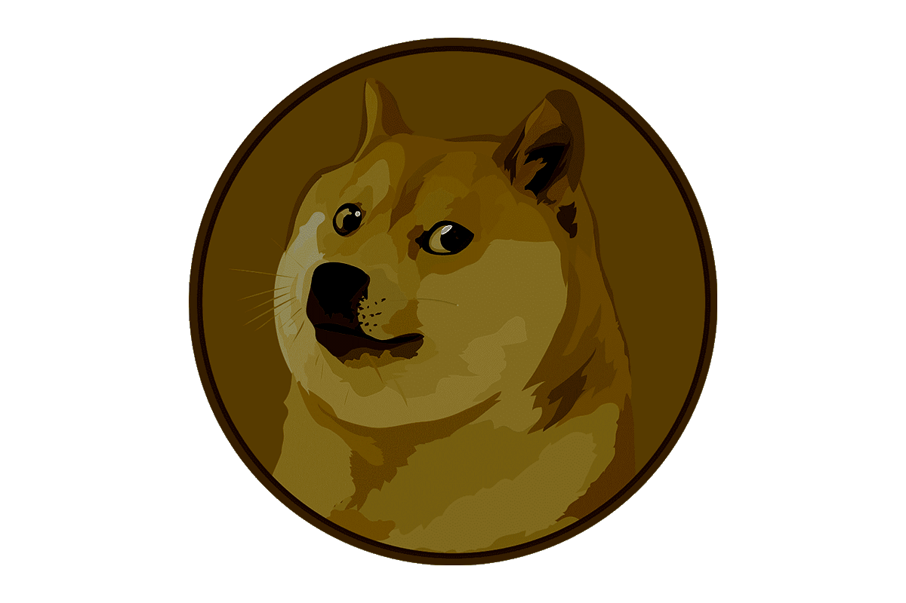
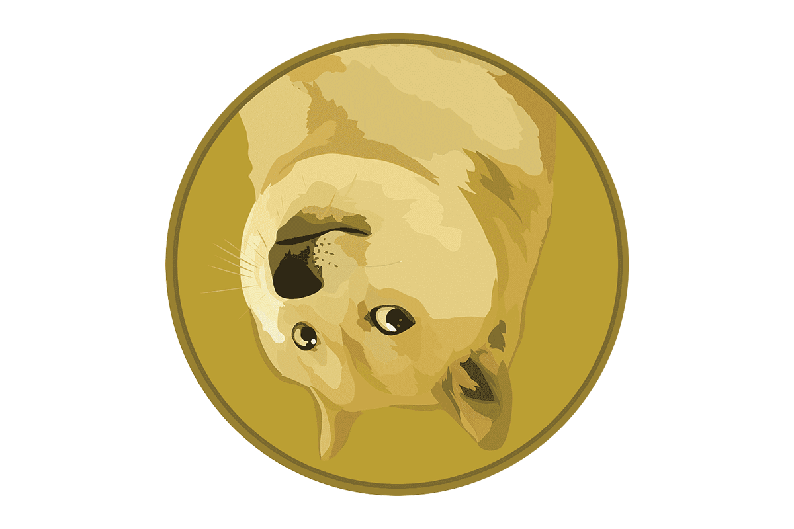
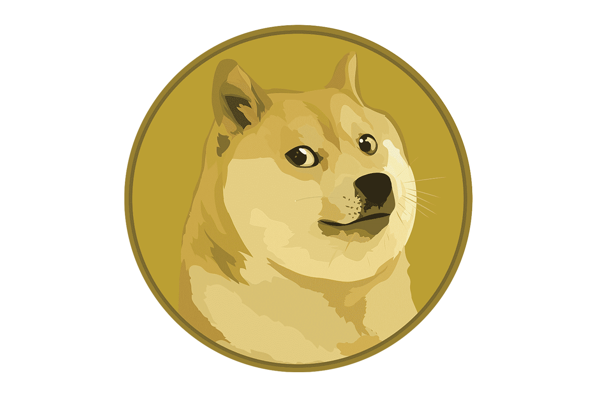
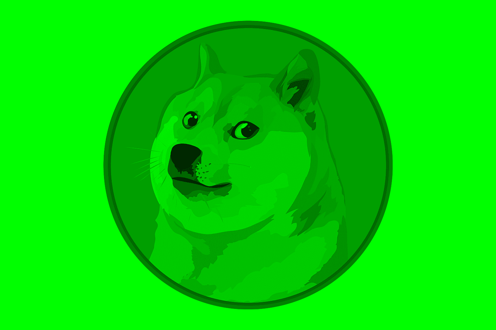
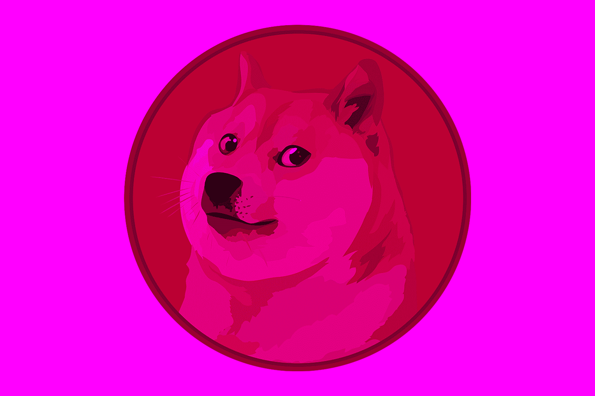

 # Image Editor Terminal Version
 ### By: Krupakar Reddy S

 This [Image Editor](https://github.com/Krupakar-Reddy-S/Image-Editor-Terminal "Link to Github Repo") is terminal based, where given an image file path and operation it outputs an image with the operation applied to it.

&nbsp;

## Supported Operations
- Convert Image to GrayScale
- Change Image Brightness
- Change Image Contrast
- Rotate Image (Left, Right)
- Flip Image (Vertical, Horizontal)
- Blur Image (Mosaic)
- Invert Image Colour
- Crop Image
- Apply Colour Filters (RGB Channels)
 
 :cool: Bonus: File Output Format is same as Input Image Format!

&nbsp;
## Imported Classes:
>
> &nbsp;
> ### 1. java.io.File.File(String pathname)
> File is a Sub-Class of Class io, It gives access to a file's provided it's path so the data from a file can be used to perform required operations, it throws exception if file is not present or path is invalid.
> &nbsp;
>
> - #### ImageIO.read(File input)
>   This Method of Class ImageIO accepts an image File as input and it's data can be accesed and manipulated and throws exception if file is not an Image.
> - #### ImageIO.read(File input)
>   This Method of Class ImageIO creates an image File in Current Working Directory if not exits, else it Over-Writes the File with new data as provided.
>
> ### 3. java.awt.image.BufferedImage
> The Class BufferedImage can be used to access and manipulate pixels and the RGB values from an image File.
>
> ### 4. java.awt.Color(int rgb)
> This Class accepts a combined int of RGB values of a Pixel and can be used to return a individual color value using the methods: getRed(), getGreen(), getBlue().
>
> &nbsp;

&nbsp;

## Functions to perform Operations:
&nbsp;

> ### Basic Image File Code, And creating a BufferedImage to pass example image to below mentioned methods
> &nbsp;
>
>>```java
>> File inputFile = new File("DogeCoin.png");
>>
>> try {
>>     BufferedImage inputImage = ImageIO.read(inputFile);
>>     File OutputImage = new File("OutputImage.png");
>>     
>>     BufferedImage methodImage = method(inputImage);
>>     ImageIO.write(methodImage, "png", OutputImage);
>>       
>> }
>> catch (IOException e) {
>>     System.out.println("Please Enter Valid Image Path!");
>> }
>>```
>
> &nbsp;
>   #### Example Image: DogeCoin.png
>   
>
> &nbsp;

&nbsp; 

>   #### 1. convertToGrayScale(BufferedImage input)
>   
>
> &nbsp;

&nbsp; 

>   #### 2. changeBrightness(BufferedImage input, int Brightness)
>
> - int Brightness = 50;
>
>   
>
> &nbsp;
>
> - int Brightness = -50;
>
>   
>
> &nbsp;

&nbsp;

> #### 3. changeContrast(BufferedImage input, int value)
>
> - int value = 100;
>
>   
>
> &nbsp;
>
> - int value = -100;
>
>   
>
> &nbsp;

&nbsp;

>   #### 4. leftRotate(BufferedImage input)
>   
>
> &nbsp;

&nbsp;

>   #### 5. rightRotate(BufferedImage input)
>   
>
> &nbsp;

&nbsp;

>   #### 6. verticalInvert(BufferedImage input)
>   
>
> &nbsp;

&nbsp;

>   #### 7. horizontalInvert(BufferedImage input)
>   
>
> &nbsp;

&nbsp;

>   #### 8. mosaicBlur(BufferedImage input, int pixels)
>
> - int pixels = 5;
>
>   
>
> &nbsp;
>
> - int pixels = 10;
>
>   
>
> &nbsp;

&nbsp;

>   #### 9. colourInvert(BufferedImage input)
>   
>
> &nbsp;

&nbsp;

>   #### 10. cropImage(BufferedImage input, int x, int y, int Height, int Width)
>
>   1. int x = 0;\
>   int y = 0;\
>   int height = 400;\
>   int width = 600; 
>   
>
>   
>
> &nbsp;
>
>   2. int x = 0;\
>   int y = 600;\
>   int height = 400;\
>   int width = 600; 
>   
>
>   
>
> &nbsp;
>
>   3. int x = 400;\
>   int y = 600;\
>   int height = 400;\
>   int width = 600; 
>   
>
>   
>
> &nbsp;
>
>   4. int x = 400;\
>   int y = 0;\
>   int height = 400;\
>   int width = 600; 
>   
>
>   
>
> &nbsp;
>
>   5. int x = 0;\
>   int y = 0;\
>   int height = 400;\
>   int width = 1200; 
>
> &nbsp;
>
>   
>
> &nbsp;
>
>   6. int x = 400;\
>   int y = 0;\
>   int height = 400;\
>   int width = 1200; 
>   
> &nbsp;
>
>   
>
> &nbsp;


&nbsp;

>   #### 11. colourFilter(BufferedImage input, boolean R, boolean G, boolean B)
>
> - boolean R = true; 
>   boolean G = false;
>   boolean B = false; 
>   
>
>   
>
> &nbsp;
>
> - boolean R = false; 
>   boolean G = true;
>   boolean B = false; 
>   
>
>   
>
> &nbsp;
> 
> - boolean R = false; 
>   boolean G = false;
>   boolean B = true; 
>   
>
>   
>
> &nbsp;
>
> - boolean R = true; 
>   boolean G = true;
>   boolean B = false; 
>   
>
>   
>
> &nbsp;
>
> - boolean R = true; 
>   boolean G = false;
>   boolean B = true; 
>   
>
>   
>
> &nbsp;
> 
> - boolean R = false; 
>   boolean G = true;
>   boolean B = true; 
>   
>
>   
>
> &nbsp;

&nbsp;