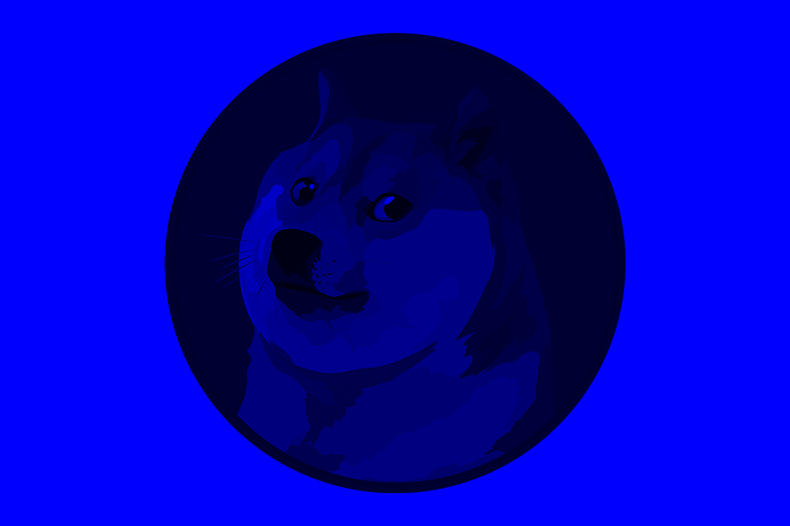

 # Image Editor Terminal Version
### [BY: KRUPAKAR REDDY S](https://github.com/Krupakar-Reddy-S)

 This [Image Editor](https://github.com/Krupakar-Reddy-S/Image-Editor-Terminal "Link to Github Repo") is terminal based, where given an image file path and operation it outputs an image with the operation applied to it.

&nbsp;

## Supported Operations
- Convert Image to GrayScale
- Change Image Brightness
- Change Image Contrast
- Rotate Image (Left, Right)
- Flip Image (Vertical, Horizontal)
- Blur Image (Mosaic)
- Invert Image Colour
- Crop Image
- Apply Colour Filters (RGB Channels)
 
 :cool: Bonus: File Output Format is same as Input Image Format!

&nbsp;
## Imported Classes:
>
> &nbsp;
> ### 1. java.io.File.File(String pathname)
> File is a Sub-Class of Class io, It gives access to a file's provided it's path so the data from a file can be used to perform required operations, it throws exception if file is not present or path is invalid.
> &nbsp;
>
> - #### ImageIO.read(File input)
>   This Method of Class ImageIO accepts an image File as input and it's data can be accesed and manipulated and throws exception if file is not an Image.
> - #### ImageIO.read(File input)
>   This Method of Class ImageIO creates an image File in Current Working Directory if not exits, else it Over-Writes the File with new data as provided.
>
> ### 3. java.awt.image.BufferedImage
> The Class BufferedImage can be used to access and manipulate pixels and the RGB values from an image File.
>
> ### 4. java.awt.Color(int rgb)
> This Class accepts a combined int of RGB values of a Pixel and can be used to return a individual color value using the methods: getRed(), getGreen(), getBlue().
>
> &nbsp;

&nbsp;

## Functions to perform Operations:
&nbsp;

> ### Basic Image File Code, And creating a BufferedImage to pass example image to below mentioned methods
> &nbsp;
>
>>```java
>> File inputFile = new File("DogeCoin.png");
>>
>> try {
>>     BufferedImage inputImage = ImageIO.read(inputFile);
>>     File OutputImage = new File("OutputImage.png");
>>     
>>     BufferedImage methodImage = method(inputImage);
>>     ImageIO.write(methodImage, "png", OutputImage);
>>       
>> }
>> catch (IOException e) {
>>     System.out.println("Please Enter Valid Image Path!");
>> }
>>```
>
> &nbsp;
>   #### Example Image: DogeCoin.png
> 
>   
>
> &nbsp;

&nbsp; 

>   #### 1. convertToGrayScale(BufferedImage input)
>
> This method takes a BufferedImage as input and returns the image in grayscale using the BufferedImage type "TYPE_BYTE_GREY", Which instead of the default RGB only stores a single value from [0 - 255], where 255 indicates White and 0 indicates Black.
> 
>   
>
> &nbsp;

&nbsp; 

>   #### 2. changeBrightness(BufferedImage input, int Brightness)
>
> This method take a BufferedImage as input and an int **Brightness**, by which the RBG values of individual pixels are increased by. This is done by getting the colour values seperately using Color Class and creating a new Color Object after adding the value of **Brightness** to each of colour channel.
>
> - int Brightness = 50;
>
>   
>
> &nbsp;
>
> - int Brightness = -50;
>
>   
>
> &nbsp;

&nbsp;

> #### 3. changeContrast(BufferedImage input, int value)
>
> This method take a BufferedImage and an int **value**, by which the brightness is increased or decreased. Contrast of an image is simply the difference in the Brightness of dark pixels to that of lighter ones. So to increase the contrast means to make Dark pixels Darker and Light pixels Lighter.
>
> This is achieved by first getting the average Red, Green, and Blue value of all the pixels in the image and if a given pixels RGB is less than the average then subtract **value** from it, else add **value** to it.
>
> - int value = 100;
>
>   
>
> &nbsp;
>
> - int value = -100;
>
>   
>
> &nbsp;

&nbsp;

>   #### 4. leftRotate(BufferedImage input)
>
> This method takes an BufferedImage as input and return the image Rotated to the **Left**. This is done by transposing the matrix of pixels from the Deimension of Height,Width to Width,Heigth.
> 
>   
>
> &nbsp;

&nbsp;

>   #### 5. rightRotate(BufferedImage input)
>
> This method takes an BufferedImage as input and return the image Rotated to the **Right**. This is done by transposing the matrix of pixels from the Deimension of Height,Width to Width,Heigth.
> 
>   
>
> &nbsp;

&nbsp;

>   #### 6. verticalInvert(BufferedImage input)
>
> This method takes an BufferedImage as input and returns it **vertically** inverted. This is done by swapping the image's pixel values from the lower and upper halves from the ends to the center.
> 
>   
>
> &nbsp;

&nbsp;

>   #### 7. horizontalInvert(BufferedImage input)
>
> This method takes an BufferedImage as input and returns it **horizontally** inverted. This is done by swapping the image's pixel values from start to end with end to start resulting in an mirror Image.
> 
>   
>
> &nbsp;

&nbsp;

>   #### 8. mosaicBlur(BufferedImage input, int pixels)
>
> This method takes an BufferedImage and an int **pixels** and return a blurred image. This is done by choosing matrix of size **pixels** from the original image and setting each pixels value to that of the average of the matrix's RGB value, resulting in a **Mosaic** blur.
>
> - int pixels = 5;
>
>   
>
> &nbsp;
>
> - int pixels = 10;
>
>   
>
> &nbsp;

&nbsp;

>   #### 9. colourInvert(BufferedImage input)
>
> This method takes an BufferedImage as input and returs an it with the colour values inverted. That means each pixels value is set to 255 - original value, resulting in colour inversion.
>  
>   
>
> &nbsp;

&nbsp;

>   #### 10. cropImage(BufferedImage input, int x, int y, int Height, int Width)
>
> This method takes an BufferedImage as input along with parameters like **x** and **y** coordinates from which to start cropping and the **Height** and **Width**, till which the image will be Cropped.
>
> This is done by creating a buffered Image of size (Height - x) and (Width - y) and sets its RGB values from x to (Height + x) and y to (Width + y) resulting in a Cropped Image.
>
>   1. int x = 0;\
>   int y = 0;\
>   int height = 400;\
>   int width = 600; 
>   
>
>   
>
> &nbsp;
>
>   2. int x = 0;\
>   int y = 600;\
>   int height = 400;\
>   int width = 600; 
>   
>
>   
>
> &nbsp;
>
>   3. int x = 400;\
>   int y = 600;\
>   int height = 400;\
>   int width = 600; 
>   
>
>   
>
> &nbsp;
>
>   4. int x = 400;\
>   int y = 0;\
>   int height = 400;\
>   int width = 600; 
>   
>
>   
>
> &nbsp;
>
>   5. int x = 0;\
>   int y = 0;\
>   int height = 400;\
>   int width = 1200; 
>
> &nbsp;
>
>   
>
> &nbsp;
>
>   6. int x = 400;\
>   int y = 0;\
>   int height = 400;\
>   int width = 1200; 
>   
> &nbsp;
>
>   
>
> &nbsp;


&nbsp;

>   #### 11. colourFilter(BufferedImage input, boolean R, boolean G, boolean B)
>
> This method takes an BufferedImage and three boolean values **R, G, B** and returning an image which only include a colour channel if it's boolean value is true resulting in Coloured Filters.
>
> - boolean R = true; 
>   boolean G = false;
>   boolean B = false; 
>   
>
>   
>
> &nbsp;
>
> - boolean R = false; 
>   boolean G = true;
>   boolean B = false; 
>   
>
>   
>
> &nbsp;
> 
> - boolean R = false; 
>   boolean G = false;
>   boolean B = true; 
>   
>
>   
>
> &nbsp;
>
> - boolean R = true; 
>   boolean G = true;
>   boolean B = false; 
>   
>
>   
>
> &nbsp;
>
> - boolean R = true; 
>   boolean G = false;
>   boolean B = true; 
>   
>
>   
>
> &nbsp;
> 
> - boolean R = false; 
>   boolean G = true;
>   boolean B = true; 
>   
>
>   
>
> &nbsp;

&nbsp;